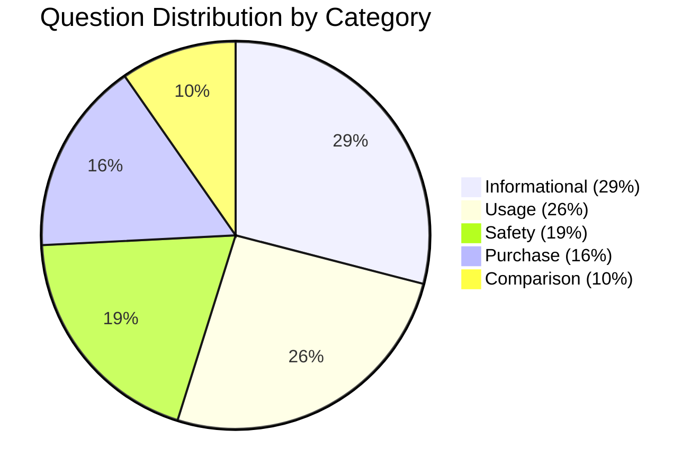
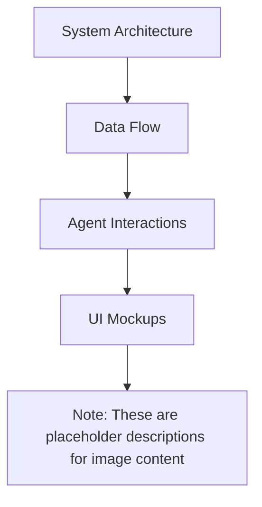
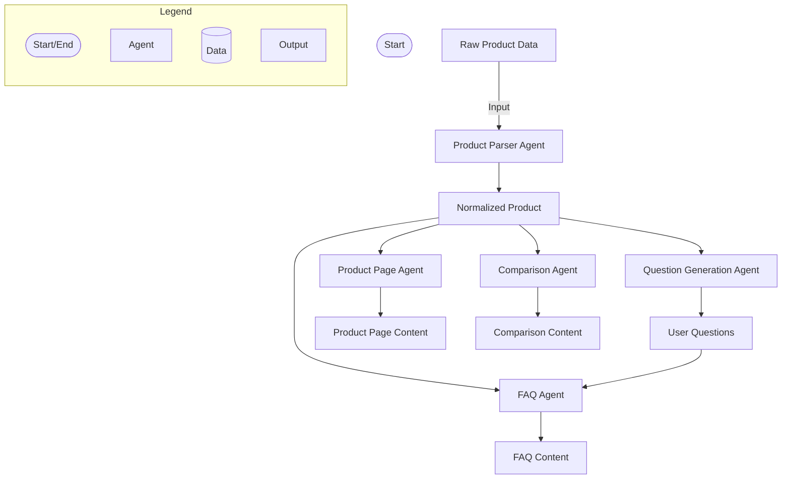
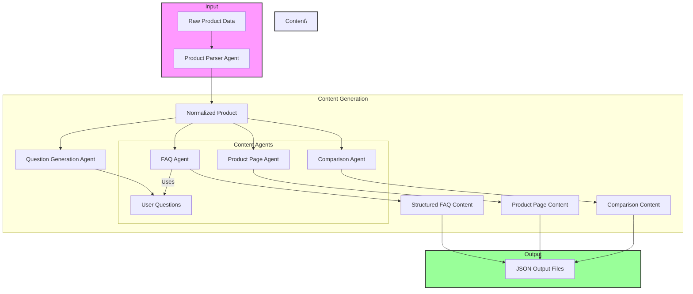
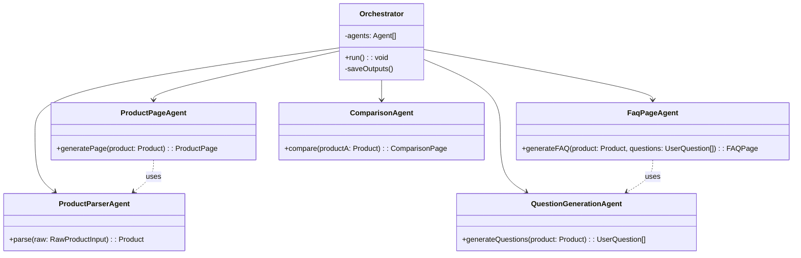
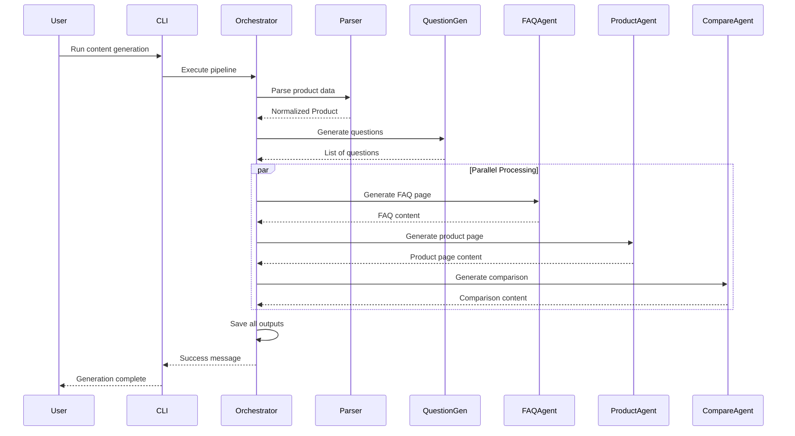
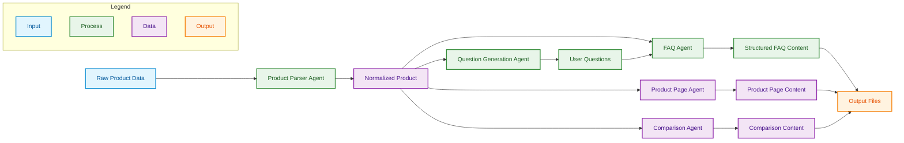
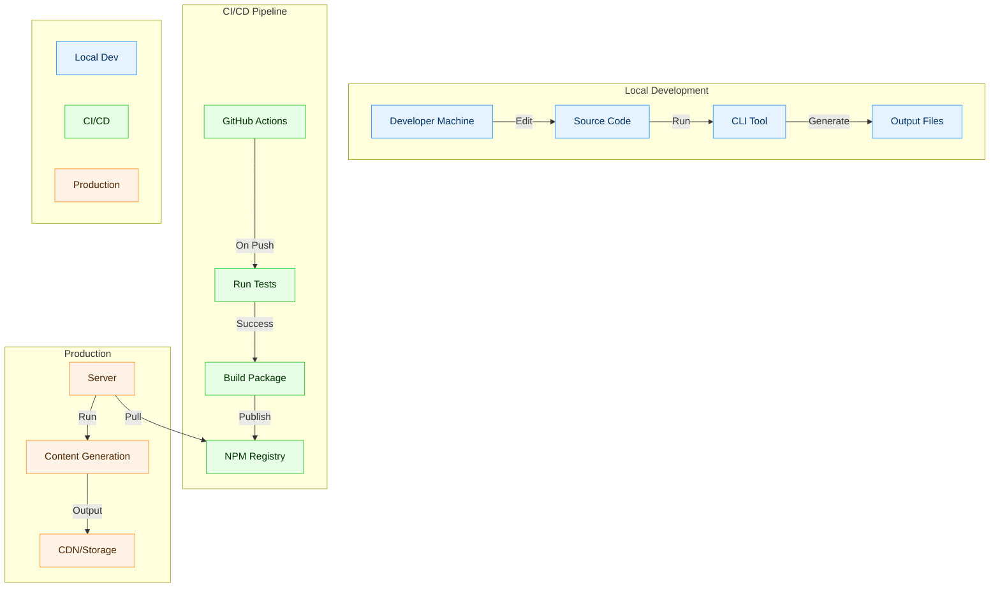
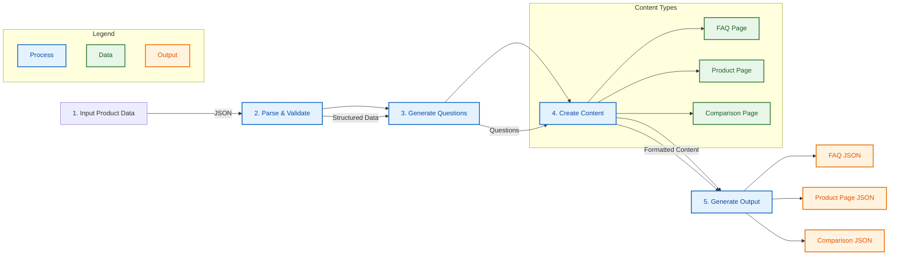

# LangChain-based Agentic Content Generation System

## Problem Statement

Given a small, constrained product dataset for a skincare product, design and implement a **LangChain-based agentic system** that:

- Parses raw product data into a clean internal model using LangChain tools
- Generates categorized user questions through deterministic logic
- Implements a content generation pipeline using LangChain's `RunnableSequence`
- Creates three structured content pages:
  - FAQ Page
  - Product Description Page
  - Comparison Page (GlowBoost vs. fictional Product B)
- Outputs all pages as clean, machine-readable JSON

The system leverages LangChain's abstractions for agent orchestration while maintaining a deterministic, no-external-API approach.

---

## Solution Overview

The solution is a TypeScript-based CLI system built on LangChain, composed of:

- **LangChain Tools**: Specialized tools for data loading, parsing, and content generation
- **Runnable Pipelines**: Composable workflows using `RunnableSequence` for clear data flow
- **Deterministic Logic**: Pure functions for content generation without external API dependencies
- **Structured Outputs**: Type-safe JSON generation with Zod validation

## LangChain Implementation

The system is built using LangChain's core abstractions:

1. **Tools**:
   - `loadRawProduct`: Loads and validates input data
   - `parseProduct`: Converts raw data to structured format
   - `generateQuestions`: Creates user questions deterministically
   - Page generation tools for each content type
   - `writeOutputFiles`: Handles file system operations

2. **Runnable Pipeline**:
   ```typescript
   const pipeline = RunnableSequence.from([
     // 1. Load raw product
     // 2. Parse into structured format
     // 3. Generate questions
     // 4. Build all pages
     // 5. Write outputs
   ]);
   ```

3. **Type Safety**:
   - Input/Output types for all tools
   - Zod schemas for validation
   - Clear data flow between components

## Outputs

The pipeline takes a single product JSON (`data/product.json`) as input and produces:

- `output/faq.json`
- `output/product_page.json`
- `output/comparison_page.json`

All content is generated through deterministic logic with no hidden prompts or external API calls.

---

## Scopes & Assumptions

- **Scope**
  - Supports a single product at a time, but the architecture allows more products with minimal changes
  - Generates comprehensive content including 31 categorized questions
  - Focuses on structured content generation for e-commerce products
  - Handles various content types: FAQs, product pages, and comparisons

- **Assumptions**
  - No external research or domain knowledge is added for the primary product. Only the provided fields are used
  - A fictional Product B is constructed as structured data within the system for the comparison page
  - JSON outputs must be consumable by downstream systems (e.g., CMS, frontend)
  - Questions are categorized into: informational, usage, safety, purchase, and comparison
  - All content is generated based on the provided product data structure

---

## Content Coverage

### 1. Question Distribution



### Sample Questions by Category

#### 1. Informational
- What is [product]?
- What are the key ingredients in [product]?
- What are the main benefits of using [product]?
- Which skin types is [product] suitable for?
- What is the Vitamin C concentration in [product]?
- How long does it take to see results with [product]?
- What is the shelf life of [product] after opening?
- How should I store [product] to maintain its potency?
- Does [product] need to be refrigerated?

#### 2. Usage
- How should I use [product] in my routine?
- When during the day should I apply [product]?
- How many drops of [product] should I use at a time?
- Should I apply sunscreen after using [product]?
- Can I use [product] with other active ingredients like retinol or AHAs?
- Do I need to shake [product] before use?
- What visible changes can I expect from using [product]?
- How long will the results from using [product] typically last?

#### 3. Safety
- Are there any side effects of using [product]?
- Is [product] suitable for sensitive skin?
- What should I do if I feel tingling after applying [product]?
- Can I use [product] during pregnancy or while breastfeeding?
- What should I do if [product] gets into my eyes?
- Can I use [product] if I have a Vitamin C allergy?

#### 4. Purchase
- What is the price of [product]?
- Is [product] a daily-use product or occasional treatment?
- What size options are available for [product]?
- Is there a money-back guarantee for [product]?
- Where can I buy authentic [product]?

#### 5. Comparison
- How does [product] compare to another Vitamin C serum?
- How does the concentration of [product] compare to other serums?
- What makes [product] different from other serums on the market?

## System Design

### Image Content




### 1. Agent Orchestration Flow (DAG)



### 2. High-Level Architecture



### 2. System Components



### 3. Content Generation Flow



### 4. Data Flow Diagram



### 5. Deployment Architecture



### 1. Core Concepts

1. **Product Model**
   - `RawProductInput` mirrors the input dataset.
   - `Product` is the normalized internal model used by all agents and blocks.

2. **Agents**
   - Each agent:
     - Has a single responsibility.
     - Implements `Agent<I, O>` interface.
     - Communicates only through explicit inputs/outputs and a shared `AgentContext` (no hidden global state).

3. **Content Blocks**
   - Pure functions (no I/O, no context mutation).
   - Examples:
     - `generateQuestionsBlock(product)`
     - `buildFAQItemsBlock(product, questions)`
     - `summarizeProductForHero(product)`
     - `buildComparisonSummariesBlock(productA, productB)`
     - `buildComparisonPointsBlock(summaryA, summaryB)`

4. **Templates**
   - Encoded as `TemplateDefinition` objects.
   - Define:
     - `pageType` (faq, product, comparison)
     - `fields` and types
     - Optional `rules` (e.g., minQuestions)
     - `requiredBlocks` (dependencies on content blocks)

5. **Orchestrator**
   - Encapsulates the automation graph (pipeline).
   - No business logic; only coordinates agents and persists results.

---

### 2. Agent Responsibilities

1. **ProductParserAgent**
   - **Input:** `RawProductInput`
   - **Output:** `Product`
   - **Responsibility:** Normalize raw JSON fields into the internal product model (split lists, trim strings, etc.).

2. **QuestionGenerationAgent**
   - **Input:** `Product`
   - **Output:** `UserQuestion[]`
   - **Responsibility:** Use `generateQuestionsBlock` to produce at least 15 categorized questions (informational, usage, safety, purchase, comparison).

3. **FaqPageAgent**
   - **Input:** `{ product: Product; questions: UserQuestion[] }`
   - **Output:** `FAQPage`
   - **Responsibility:**
     - Map questions to answers using `buildFAQItemsBlock`.
     - Group Q&As by `category` into FAQ sections.

4. **ProductPageAgent**
   - **Input:** `Product`
   - **Output:** `ProductPage`
   - **Responsibility:**
     - Build hero section using `summarizeProductForHero`.
     - Assemble details (ingredients, benefits, usage, side-effects) into a structured page.

5. **ComparisonPageAgent**
   - **Input:** `{ productA: Product }`
   - **Output:** `ComparisonPage`
   - **Responsibility:**
     - Create a structured fictional Product B.
     - Use `buildComparisonSummariesBlock` and `buildComparisonPointsBlock` to generate comparison summaries and rows.

---

### 3. Automation Flow / Orchestration Graph

The system follows a **directed acyclic graph (DAG)** of agent invocations:

1. **Parse Product**
   - `ProductParserAgent`  
   `RawProductInput → Product`

2. **Generate Questions**
   - `QuestionGenerationAgent`  
   `Product → UserQuestion[]`

3. **Generate FAQ Page**
   - `FaqPageAgent`  
   `{ Product, UserQuestion[] } → FAQPage`

4. **Generate Product Page**
   - `ProductPageAgent`  
   `Product → ProductPage`

5. **Generate Comparison Page**
   - `ComparisonPageAgent`  
   `{ productA: Product } → ComparisonPage`

The **Orchestrator** executes these in order, collects results, and writes:

- `faq.json`
- `product_page.json`
- `comparison_page.json`

---

### 4. Reusable Logic & Extensibility

- All page agents depend on **blocks** instead of directly using raw product data.  
  This allows:
  - Reuse across agents (e.g., benefits block could be used on FAQ and product page).
  - Easy replacement or extension (e.g., plugging in an LLM-backed block while keeping the same template).

- **Templates** are data, not code.  
  New template variants (e.g., `faq-compact-v2`) can be defined by adding new `TemplateDefinition`s and swapping them in agents or orchestrator without rewriting the flow.

---

### 5. Content Generation Process



### 6. Data & Output Structure

- All final outputs conform to TypeScript interfaces and are serialized as JSON.
- No free-form text pages; everything is structured into:
  - fields like `hero.title`, `details.skinTypes[]`, `sections[].items[]`.
- This ensures:
  - Machine readability.
  - Easy consumption by frontends, CMSs, or downstream services.
